# Codex Handoff

Secure bidirectional synchronization of Codex state between macOS and Windows, with encrypted backup and restore.

Codex Handoff is a free, open-source desktop application. It synchronizes selected Codex data through storage owned by the user. The current implementation supports Google Drive and a local folder. Synchronization works in both directions: macOS to Windows and Windows to macOS.

Codex Handoff is an independent community project and is not affiliated with or endorsed by OpenAI.

## Why It Exists

Codex stores useful working state locally. Copying its entire data directory between computers is unsafe: it can include authentication data, machine-specific settings, caches, locks, temporary files, and databases that may still be in use.

Codex Handoff uses a controlled synchronization process instead:

- only an explicit portable profile is included;
- Codex must be closed before state is captured or applied;
- every published state is a separate immutable version;
- snapshots are encrypted on the device before upload;
- the receiving device previews an update and asks for confirmation;
- a local backup is created before an update or restore is applied;
- the original protected baseline cannot be replaced by normal synchronization.

This is near-real-time, user-controlled synchronization rather than silent live file mirroring. While the desktop application is open, it checks the selected storage every 30 seconds and notifies the user about a new version. It never applies a remote update without confirmation.

## How Synchronization Works

```mermaid
flowchart LR
    A["Codex state on device A"] --> B["Portable profile filter"]
    B --> C["Versioned snapshot and SHA-256 manifest"]
    C --> D["AES-256-GCM encryption"]
    D --> E["User's Google Drive or local folder"]
    E --> F["Update detection on device B"]
    F --> G["Preview and user confirmation"]
    G --> H["Local pre-apply backup"]
    H --> I["Integrity verification and staged apply"]
    I --> J["Codex state on device B"]
```



The same path works in reverse. After device B applies the latest cloud version, it can publish its own newer version. Device A then detects, previews, and applies that update.

Each device records the last version it applied. Before publishing, Codex Handoff compares that value with the current cloud version. If the device is stale, publication stops and the user must synchronize from the cloud first. This prevents an older device from unknowingly replacing the newest synchronization state.

## First-Time Setup

### 1. Prepare Google Drive

Create Desktop OAuth credentials in Google Cloud, enable the Google Drive API, and download the client JSON. Detailed instructions are in [Google Drive setup](docs/GOOGLE_DRIVE.md).

Codex Handoff requests the limited `drive.file` scope. It can access files created or explicitly opened by this application, not the user's entire Google Drive.

### 2. Configure the first device

On first launch, select:

- a unique device name;
- the local Codex state directory, normally `~/.codex`;
- the application's local workspace;
- Google Drive or a local-folder provider;
- the Google Desktop OAuth JSON when Google Drive is selected;
- a recovery-key file.

Choose **Create new** for the recovery key on the first device. Keep a separate offline copy. The key is required to decrypt every protected baseline and synchronization version; it is never uploaded to Google Drive and cannot be recovered by the project maintainers.

### 3. Create the protected baseline

Close Codex and select **Create baseline**. The application captures the portable profile, creates a manifest, encrypts the artifact, and uploads the first protected copy.

Only one baseline can exist in the configured storage. Normal publish, synchronization, retention, and restore operations do not overwrite or delete it. The GUI can restore this baseline later.

### 4. Connect the second device

Install Codex Handoff on the second computer and configure it with:

- the same Google account;
- Desktop OAuth credentials from the same Google Cloud project;
- a secure copy of the same recovery key;
- a different device name;
- that computer's local Codex state directory.

The second device discovers the protected baseline and published versions in the shared application folder.

## Normal Workflow

### Publish changes from macOS

1. Finish work and close Codex on the Mac.
2. Select **Sync to cloud** in Codex Handoff.
3. Confirm publication.
4. The application filters the portable data, creates a versioned snapshot and manifest, encrypts the snapshot, uploads it, and updates the cloud pointer only after the artifact is available.

If Codex is still running after confirmation, Codex Handoff asks the user to close it, waits, and continues automatically when the process exits. Waiting can be cancelled.

### Apply changes on Windows

1. Keep Codex Handoff open on Windows. It checks for an update every 30 seconds and can display a system notification.
2. Select **Sync from cloud**.
3. Review the source device and the number of added and changed files.
4. Confirm the update and close Codex if it is running.
5. The application downloads and decrypts the snapshot, verifies its manifest and SHA-256 hashes, creates a local encrypted backup, stages the files, and applies the version.

### Synchronize back to macOS

The process is identical in the opposite direction. After Windows has applied the latest version, close Codex on Windows and select **Sync to cloud**. The Mac detects the newer version and applies it through **Sync from cloud** after preview and confirmation.

## What Is Synchronized

The built-in `safe` profile is an allowlist. It currently includes:

| Included | Purpose |
| --- | --- |
| `sessions/` | Active Codex session data |
| `archived_sessions/` | Archived session data |
| `attachments/` | Session attachments |
| `session_index.jsonl` | Portable session index |
| `skills/` | User-installed skills |
| `plugins/` | User-installed plugins |
| `rules/` | User rules |
| `AGENTS.md` | User instructions |

The profile excludes symlinks and files matching lock, temporary, log, cache, SQLite, database, WAL, or shared-memory patterns. Authentication tokens and machine-specific configuration are not part of the allowlist.

The project does not blindly synchronize the entire `.codex` directory. This reduces the risk of copying credentials, active databases, process locks, or platform-specific state between operating systems.

## Protection and Recovery

### Protected baseline

The baseline is the first known-good parent copy. It is stored as an immutable encrypted artifact and cannot be recreated over an existing baseline through the normal application flow. Select **Restore baseline** in the GUI to return the portable profile to that initial state.

### Version history

Every publication receives a unique version ID, parent version, source-device ID, UTC timestamp, file list, file sizes, and SHA-256 hashes. Published snapshot artifacts are never edited in place. The GUI lists available versions and can restore a selected one.

### Pre-apply backup and rollback

Before applying a cloud version or restoring an older version, the receiving device creates a local encrypted backup of its current portable state. If applying the requested artifact fails, Codex Handoff attempts to roll back automatically from that backup.

### Encryption and integrity

- snapshot contents are encrypted locally with AES-256-GCM;
- the recovery key stays on the user's devices;
- each file is checked against the SHA-256 digest stored in the manifest;
- archive paths are validated before extraction;
- files are prepared in a staging directory before replacement;
- the mutable cloud pointer is updated only after the immutable artifact is uploaded.

Google Drive can see the application folder, encrypted object names, version identifiers, timestamps, and limited metadata. It cannot read snapshot contents without the recovery key. See [Privacy](PRIVACY.md) and [Security](SECURITY.md).

## Implemented Features

- shared Python synchronization core for macOS and Windows;
- PySide6 desktop GUI and command-line interface;
- first-run configuration wizard;
- Google Drive OAuth and resumable uploads;
- local-folder provider for development, testing, or user-managed shared storage;
- bidirectional versioned synchronization;
- 30-second update polling and system notifications;
- update preview and explicit user confirmation;
- detection of a running Codex process and cancellable waiting;
- immutable protected baseline and in-app baseline restore;
- remote version history and selected-version restore;
- encrypted local backup before apply or restore;
- automatic rollback after an apply failure;
- stale-device and concurrent-update checks;
- cryptographic integrity and archive-path verification;
- automated tests for snapshots, encryption, providers, process detection, GUI behavior, and the end-to-end local synchronization flow;
- GitHub Actions builds for Apple Silicon macOS and 64-bit Windows.

## Storage Model

Codex Handoff writes an application-owned `Codex Handoff` folder to Google Drive. It contains:

- one protected `baseline-*.chandoff` artifact;
- immutable `version-*.chandoff` synchronization artifacts;
- a small mutable `head.json` pointer to the newest published version.

Files with the `.chandoff` extension are encrypted containers. The application keeps configuration, the Google refresh token, device state, downloaded artifacts, staging data, and pre-apply backups in operating-system-specific per-user application directories outside the synchronized Codex profile.

The repository contains a provider interface, so another storage backend can be added without changing the snapshot, encryption, verification, or apply logic.

## Desktop Downloads

The [GitHub Releases](https://github.com/Raf4ik/codex-handoff/releases) page provides unsigned beta builds:

- `CodexHandoff-macOS-arm64.dmg` for Apple Silicon Macs, M1 or newer;
- `CodexHandoff-Windows-x64.exe` for 64-bit Windows 10 or newer.

Python, Qt, and the required libraries are bundled into both downloads. End users do not install Python separately.

The builds are currently unsigned. macOS Gatekeeper or Windows SmartScreen may display a warning on first launch. Removing these warnings requires Apple Developer ID notarization and a Windows Authenticode certificate; those paid credentials are not included in this free open-source project. See [desktop builds](docs/BUILDING.md).

## Run from Source

Requirements: Python 3.11 or newer.

```bash
python -m venv .venv
.venv/bin/python -m pip install -e '.[dev]'
.venv/bin/python -m pytest
```

On Windows, use `.venv\Scripts\python.exe` instead of `.venv/bin/python`.

Start the desktop interface:

```bash
python -m codex_handoff gui
```

The same core is available through the CLI:

```bash
python -m codex_handoff --help
```

Available commands are `gui`, `status`, `baseline`, `push`, `pull`, `versions`, and `restore`.

## Current Beta Limitations

- Users currently provide their own Google Desktop OAuth JSON. A project-wide verified Google consent screen is not bundled yet.
- Live Google Drive authentication and a full physical Mac-to-Windows-to-Mac cycle still require release-level validation with real user credentials.
- Google Drive does not provide transactional compare-and-swap. Simultaneous publication from two devices is unsupported; finish synchronization on one device before publishing from another.
- Update detection works while the desktop application is running and polls every 30 seconds. There is no background system service yet.
- The update preview currently reports added and changed files by count; it is not a full visual file-diff viewer.
- The portable profile has been checked against a current macOS Codex directory but still needs validation against a real Windows installation and future Codex versions.
- The `.dmg` and `.exe` builds are unsigned beta artifacts.

These limitations are why the current release is marked as a prerelease rather than stable.

## Project Status

- [x] Public repository and Apache-2.0 license
- [x] Versioned local snapshots and protected baseline
- [x] Bidirectional synchronization with explicit confirmation
- [x] Google Drive and local-folder providers
- [x] Restore preview, pre-apply backup, and rollback
- [x] macOS and Windows GUI source
- [x] Automated unsigned `.dmg` and standalone `.exe`
- [ ] Real macOS-to-Windows-to-Mac Google Drive release validation
- [ ] Verified project-wide Google OAuth distribution flow
- [ ] Signed and notarized stable installers

## Русская версия

Codex Handoff — бесплатное приложение с открытым исходным кодом для безопасной двусторонней синхронизации выбранного состояния Codex между macOS и Windows. Оно не копирует каталог `.codex` целиком: программа собирает только разрешённые для синхронизации данные, создаёт отдельную версию, шифрует её на устройстве и публикует в Google Drive пользователя либо в выбранную локальную папку.

Синхронизация работает в обоих направлениях:

```text
macOS -> Google Drive -> Windows
Windows -> Google Drive -> macOS
```

Это контролируемая синхронизация, а не незаметное фоновое зеркалирование файлов. Пока приложение открыто, оно проверяет хранилище каждые 30 секунд и сообщает о новой версии. Полученное обновление применяется только после предварительного просмотра и явного подтверждения пользователя.

### Полный путь синхронизации

1. На первом устройстве пользователь настраивает Google Drive, создаёт ключ восстановления и закрывает Codex.
2. Codex Handoff создаёт неизменяемую исходную родительскую копию — защищённый baseline.
3. После работы в Codex пользователь закрывает его и нажимает **Sync to cloud**.
4. Программа выбирает только данные безопасного профиля, создаёт снимок с манифестом и SHA-256-хешами, шифрует его с помощью AES-256-GCM и загружает как новую неизменяемую версию.
5. Приложение на втором устройстве обнаруживает обновление и показывает уведомление.
6. Пользователь нажимает **Sync from cloud**, видит источник и количество добавленных и изменённых файлов, затем подтверждает применение.
7. Если Codex запущен, приложение ждёт его закрытия. Ожидание можно отменить.
8. Перед применением создаётся локальная зашифрованная резервная копия текущего состояния.
9. Загруженный снимок расшифровывается, проверяется и применяется через временный каталог.
10. После работы на втором устройстве тот же процесс выполняется в обратном направлении.

Если устройство не получило последнюю облачную версию, оно не сможет опубликовать поверх неё старое состояние: защита от устаревшего устройства потребует сначала выполнить синхронизацию из облака.

### Что входит в синхронизацию

По умолчанию включены `sessions`, `archived_sessions`, `attachments`, `session_index.jsonl`, `skills`, `plugins`, `rules` и `AGENTS.md`.

Не синхронизируются токены авторизации, платформенные настройки, символические ссылки, кеши, lock-файлы, журналы, временные файлы, базы SQLite и их активные WAL/SHM-файлы. Такой разрешительный список уменьшает риск попадания в облако секретов и несовместимого машинного состояния.

### Резервные копии и восстановление

- Исходный baseline создаётся один раз и не может быть затёрт обычной синхронизацией.
- В GUI можно восстановить защищённый baseline или выбранную опубликованную версию.
- Перед любым применением или восстановлением создаётся локальная зашифрованная резервная копия.
- При ошибке применения программа пытается автоматически вернуть предыдущее локальное состояние.
- Потерянный ключ восстановления вернуть невозможно, поэтому его отдельную копию нужно хранить в безопасном месте.

### Что уже реализовано

Проект включает общее Python-ядро, CLI, графический интерфейс PySide6, мастер первого запуска, Google Drive OAuth, локальное тестовое хранилище, шифрование AES-256-GCM, проверку целостности, историю версий, уведомления, подтверждение обновлений, ожидание закрытия Codex, защиту от устаревшей публикации, восстановление и автоматические тесты.

GitHub Actions собирает неподписанные `CodexHandoff-macOS-arm64.dmg` и `CodexHandoff-Windows-x64.exe`. Python уже встроен в оба файла и отдельно пользователю не нужен. Поскольку сборки пока не подписаны, macOS Gatekeeper и Windows SmartScreen могут показать предупреждение при первом запуске.

Проект находится на стадии beta. Перед стабильным релизом ещё нужна проверка полного цикла через реальный Google Drive и физические компьютеры Mac и Windows. Одновременная публикация с двух устройств не поддерживается.

## License

Apache License 2.0. See [LICENSE](LICENSE).
